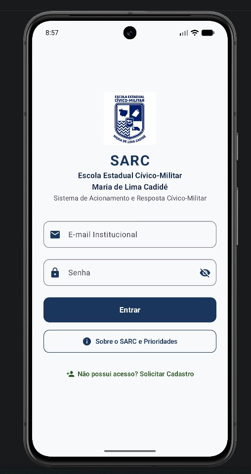

# SPRINT 01 — Product Definition & First Screen

## Team Identification

- **Team:** Team 05
- **Project:** SARC (Sistema de Acionamento e Resposta Cívico-Militar)
- **Institution:** Escola Estadual Cívico-Militar Maria de Lima Cadidé
- **Members:**
  - Matheus Gabriel de Morais Barros ([@MatheusGabriel-25](https://github.com/MatheusGabriel-25))
  - Paulo Vitor ([@PAULOSANTOS1309](https://github.com/PAULOSANTOS1309))

---

## 1. Product Definition

### Product Name
*SARC* — Sistema de Acionamento e Resposta Cívico-Militar

### Problem

No ambiente escolar da Escola Estadual Cívico-Militar Maria de Lima Cadidé, os professores em sala de aula frequentemente enfrentam situações que exigem a intervenção ou o apoio da Coordenação Militar desde orientações disciplinares leves até conflitos graves e emergências de saúde.

Atualmente, esse acionamento ocorre por meio de mensagens manuais via WhatsApp ou pelo envio presencial de alunos até a coordenação. Esse modelo apresenta problemas críticos, tais como:

1. **Falta de Padronização nas Mensagens:** Na urgência do momento, os professores enviam mensagens incompletas (omitindo a sala, turma ou a descrição da ocorrência), o que gera dúvidas e atrasa o deslocamento da equipe.

2. **Ausência de Triagem por Prioridade:** Como as mensagens chegam de forma desordenada e alunos são enviados simultaneamente, a coordenação muitas vezes atende um pedido sem saber que outra situação mais grave acabou de ocorrer. Com isso, ocorrências críticas de risco imediato (agressões físicas ou mal-estar súbito) acabam competindo pela mesma atenção que demandas de baixa urgência (uso indevido de celular ou apoio pedagógico).

3. **Falta de Histórico e Métricas:** Inexistência de registros centralizados sobre tempo de atendimento, reincidência de ocorrências e mapeamento das turmas que demandam maior suporte.

Dessa forma, há a necessidade de uma solução móvel dedicada que padronize o formato das solicitações, automatize a classificação por níveis de prioridade e garanta uma resposta rápida e estruturada.

### Target Users

Os usuários-alvo do SARC são os profissionais que estão na Escola Estadual Cívico-Militar Maria de Lima Cadidé, divididos nos seguintes perfis:

1. **Professores (Usuários Primários - Emissores):**

* **Perfil:** Docentes que necessitam solicitar apoio durante as aulas para os monitores.

* **Necessidade:** Interface ágil, intuitiva e discreta para registrar um acionamento padronizado em poucos toques, sem interromper o andamento pedagógico da aula e depois que o acionamento for atendido ele marcar como concluído para as métricas de resposta de acionamento dos monitores.

2. **Equipe e Monitores da Coordenação Militar (Usuários Primários - Atendentes):**

* **Perfil:** Policiais Militares e monitores responsáveis pela disciplina, segurança e acolhimento escolar.

* **Necessidade:** Painel de chamados com alertas sonoros/visuais organizados por prioridade (Níveis 1 a 4), permitindo identificar imediatamente qual sala precisa de intervenção urgente e confirmar o deslocamento. E depois mandar uma notificação de acionamento concluído para o professor marcar como concluído.

3. **Direção e Coordenação Pedagógica (Usuários Secundários - Gestão):**

* **Perfil:** Gestores escolares responsáveis pelo acompanhamento institucional.

* **Necessidade:** Acesso a relatórios de ocorrências, histórico de atendimentos e métricas de tempo de resposta para suporte a reuniões de pais e planejamento escolar.

### Product Goal

O objetivo principal do **SARC** é digitalizar o processo manual e descentralizado atualmente da escola, assim, padronizar e agilizar a comunicação entre os professores em sala de aula e a Coordenação Militar da Escola Estadual Cívico-Militar Maria de Lima Cadidé, garantindo uma resposta rápida, organizada e proporcional à gravidade de cada ocorrência.

A aplicação busca alcançar os seguintes resultados:

- **Acionamento Ágil em Sala:** Permitir que os docentes emitam solicitações de apoio padronizadas em poucos toques, sem precisar abandonar a sala ou enviar alunos aos corredores.

- **Triagem Inteligente por Prioridades:** Classificar automaticamente os chamados por níveis de urgência (1 a 4), garantindo que situações de risco ou saúde sejam atendidas com prioridade máxima.

- **Redução do Tempo de Resposta:** Fornecer localização exata (turma e sala) e confirmação visual de que o monitor está a caminho, reduzindo o tempo de espera.

- **Gestão e Histórico Confiável:** Registrar as ocorrências atendidas para fornecer métricas que auxiliem a coordenação pedagógica e militar em ações preventivas.

### Initial Features

- **Tela Inicial Institucional (Welcome Screen):** Identificação visual do SARC e da Escola Cadidé com botão de acesso primário ao sistema.

- **Autenticação e Controle de Acesso (Login):** Acesso seguro via usuário e senha, direcionando automaticamente para as permissões de cada perfil:

- *Docente:* Emissão rápida de chamados;

- *Monitor / Coordenação Militar:* Fila de atendimento e triagem;

- *Gestor / Direção:* Consulta de relatórios e métricas.

- **Formulário de Acionamento Rápido:** Seleção padronizada de Turma, Sala, Nível de Prioridade e breve descrição da ocorrência.

- **Classificação Automática por Prioridade:** Categorização visual por código de cores conforme o protocolo da Cadidé (Níveis 1 a 4).

- **Painel de Triagem em Tempo Real:** Listagem das ocorrências pendentes para a equipe militar, priorizando automaticamente os chamados mais urgentes.

- **Acompanhamento de Status do Chamado:** Notificação e acompanhamento do ciclo de atendimento (*Pendente*, *Em Deslocamento* e *Concluído*).

- **Histórico e Persistência Local:** Armazenamento das ocorrências no dispositivo para controle e registros da escola.

---

## 2. Feature Specification (SPEC-001)

- **Caminho da Especificação:** [`docs/specs/SPEC-001.md`](docs/specs/SPEC-001.md)

- **Resumo da Especificação:**  A primeira especificação foi definida a interface inicial da tela de login e de autenticação institucional do SARC. Nessa primeira tela tem o Brasão da Escola Cadidé centralizado no cabeçalho junto com a palavra do SARC e seu slogan junto com campos interativo para escrever o E-mail Institucional e Senha com máscara (••••••) e alternância de visibilidade, com o botão ("Entrar") para entrar no SARC, um botão informativo ("Sobre o SARC") que aparece uma mensagem sobre o que é o aplicativo e sua regra de prioridades e um botão para solicitar o seu cadastro ("Solicitar Cadastro") que no futuro aparecerá uma tela para colocar o seu nome completo, e-mail, celular e a senha que vai utilizar no aplicativo.

---

## 3. First Screen Implementation

- **Framework:** Kotlin 2.2.10 + Jetpack Compose (Material 3)
- **Módulo:** `projects/team-05/app/`
- **Componentes e Layout:**
  - `Surface` e `Column` com alinhamento central e rolagem vertical (`verticalScroll(rememberScrollState())`) para garantir responsividade e evitar corte de componentes com teclado virtual;
  - `Image` com `painterResource(R.drawable.ic_brasao_cadide)` para renderização do brasão oficial da escola em alta fidelidade;
  - `Text` estilizados com tipografia Material 3 e paleta de cores institucional (`SarcNavyPrimary`, `SarcNavyDark`, `SarcGreenSecondary`);
  - `OutlinedTextField` com cantos arredondados (12dp), ícones `leadingIcon` (Email e Lock) e botão de alternância `trailingIcon` (Visibility / VisibilityOff) com máscara de senha (`PasswordVisualTransformation`);
  - `Button` primário ("Entrar") com cores institucionais em alto contraste;
  - `OutlinedButton` secundário ("Sobre o SARC e Prioridades") com acionamento de `AlertDialog` modal contendo `Card` e `Box` coloridos para cada faixa de prioridade escolar (🟢 Nível 1 - Apoio, 🟡 Nível 2 - Atenção, 🟠 Nível 3 - Prioridade, 🔴 Nível 4 - Urgência);
  - `TextButton` terciário ("Solicitar Cadastro") com diálogo modal orientativo para novos docentes.

---

## 4. Scope

- **Fora de Escopo nesta Sprint 01:**
  - Integração com banco de dados local (Room / SQLite);
  - Autenticação e chamadas de rede com API ou servidor remoto;
  - Telas secundárias funcionais de cadastro de usuários e painel de triagem em tempo real (planejadas para sprints posteriores);
  - Envio de notificações push ou integrações de hardware.

---

## 5. Acceptance Criteria

- [x] **AC-01** — The application has a clearly defined name.
- [x] **AC-02** — The problem addressed by the application is documented.
- [x] **AC-03** — The target users are identified.
- [x] **AC-04** — The initial product goal is documented.
- [x] **AC-05** — `SPEC-001.md` exists in the required directory.
- [x] **AC-06** — SPEC-001 contains functional requirements.
- [x] **AC-07** — SPEC-001 contains measurable acceptance criteria.
- [x] **AC-08** — The first screen is implemented using Jetpack Compose.
- [x] **AC-09** — The application name is visible on the screen.
- [x] **AC-10** — A description or slogan is visible.
- [x] **AC-11** — At least one primary action button is present.
- [x] **AC-12** — The application builds successfully.
- [x] **AC-13** — The application runs without crashing.
- [x] **AC-14** — The implemented screen satisfies SPEC-001.
- [x] **AC-15** — The team can explain the implementation.

---

## 6. Validation

1. **Compilação Gradle:** O projeto foi compilado sem erros ou advertências via `./gradlew assembleDebug` (36 tarefas executadas com sucesso, APK de depuração gerado).
2. **Execução no Emulador:** O aplicativo foi instalado e executado no emulador oficial Pixel 8 (Android API 35/37) sem falhas ou travamentos.
3. **Teste Interativo de Campos:** Testada a digitação interativa no campo de E-mail Institucional e campo de Senha com máscara protetora de caracteres (`••••••`) e botão de alternância de visibilidade.
4. **Teste do Diálogo Modal de Prioridades:** Testado o clique no botão "Sobre o SARC e Prioridades", validando a abertura do modal com os 4 badges coloridos (🟢 Nível 1 - Apoio, 🟡 Nível 2 - Atenção, 🟠 Nível 3 - Prioridade, 🔴 Nível 4 - Urgência).
5. **Teste do Diálogo de Cadastro:** Testado o clique no botão "Solicitar Cadastro", validando a exibição do diálogo modal com fluxo orientador para novos servidores.
6. **Captura de Evidências:** Os prints comprobatórios foram devidamente capturados e armazenados em `projects/team-05/evidence/sprint-01/`.

---

## 7. Evidence

- **Primeira Tela (Padrão Curso):** [`evidence/sprint-01/first-screen.png`](evidence/sprint-01/first-screen.png)
- **Tela de Apresentação:** [`evidence/sprint-01/welcome-screen.png`](evidence/sprint-01/welcome-screen.png)
- **Campos Interativos Preenchidos:** [`evidence/sprint-01/welcome-screen-interactive.png`](evidence/sprint-01/welcome-screen-interactive.png)
- **Modal de Diretrizes e Prioridades:** [`evidence/sprint-01/welcome-screen-about-dialog.png`](evidence/sprint-01/welcome-screen-about-dialog.png)
- **Modal de Solicitação de Cadastro:** [`evidence/sprint-01/welcome-screen-register-dialog.png`](evidence/sprint-01/welcome-screen-register-dialog.png)

---

## 8. AI Usage

### Summary Table

| Item | Team response |
| --- | --- |
| LLM/tool used | Google Antigravity (Gemini) |
| Task supported by the LLM | Estruturação formal dos documentos de especificação (SPEC-001) e relatório (SPRINT-01), sugestão da arquitetura composable em Jetpack Compose Material 3 |
| Main suggestion received | Estrutura composable vertical responsiva em `WelcomeScreen.kt`, definição dos cards de prioridades escolares e configuração das dependências no catálogo do Gradle |
| What the team changed manually | Refinamento do escopo do problema da Escola Estadual Cívico-Militar Maria de Lima Cadidé, vetorização e inclusão do brasão oficial, definição dos textos institucionais e execução de todos os testes no emulador |
| How the result was validated | Compilação com `./gradlew assembleDebug`, teste funcional no emulador Pixel 8, conferência visual dos componentes e verificação de conformidade com os critérios de aceitação |

### Tool
Google Antigravity (Gemini).

### Purpose
Auxílio na estruturação técnica da especificação formal (SPEC-001), elaboração dos relatórios e apoio na organização da arquitetura em Jetpack Compose com Material Design 3.

### Generated Content
A IA foi utilizada como auxiliadora e guiadora nos documentos de especificação e do sprint, sugerindo a estrutura composable inicial em `WelcomeScreen.kt`, os cartões visuais de prioridade com Material Design 3 e catálogo de dependências.

### Human Changes
A equipe de alunos refinou o escopo institucional da Escola Estadual Cívico-Militar Maria de Lima Cadidé, definiu e importou o brasão oficial no drawable, ajustou as 4 faixas de prioridade e os textos explicativos dos diálogos modais, além de conduzir todos os testes e capturas de tela no dispositivo emulado.

### Validation
A solução foi compilada localmente com o Gradle (`./gradlew assembleDebug`) e validada em tempo real no emulador Pixel 8 (Android API 35/37), confirmando o cumprimento integral dos critérios da SPEC-001 e do SPRINT-01.

---

## 9. Deliverables

- `projects/team-05/app/` — Código-fonte do projeto Android
- `projects/team-05/SPRINT-01.md` — Relatório da Sprint 01
- `projects/team-05/docs/specs/SPEC-001.md` — Especificação da primeira tela
- `projects/team-05/evidence/sprint-01/first-screen.png` — Evidência de execução (requisito do curso)
- `projects/team-05/evidence/sprint-01/welcome-screen.png` — Evidência de execução complementar
