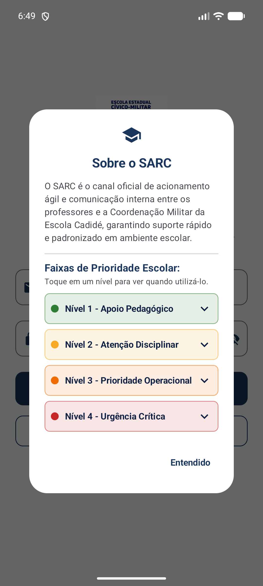
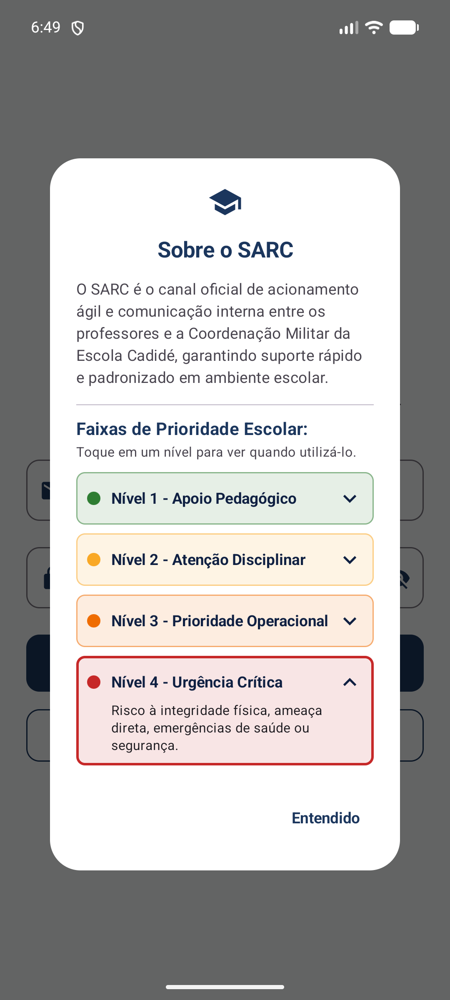

# SPRINT 02 — State & User Interaction

## Team Identification

- **Team:** Team 05
- **Project:** SARC (Sistema de Acionamento e Resposta Cívico-Militar)
- **Institution:** Escola Estadual Cívico-Militar Maria de Lima Cadidé
- **Members:**
  - Matheus Gabriel de Morais Barros ([@MatheusGabriel-25](https://github.com/MatheusGabriel-25))
  - Paulo Vitor ([@PAULOSANTOS1309](https://github.com/PAULOSANTOS1309))

---

## 1. Interaction Selection

### Selected Feature

Modais Institucionais Interativos: Cartões Expansíveis de Prioridades e Guia de Cadastro em Etapas.

### Problem Solved

Na rotina da Escola Estadual Cívico-Militar Maria de Lima Cadidé, os professores e a equipe gestora precisam de clareza imediata sobre os protocolos operacionais antes de acionar a equipe cívico-militar. Anteriormente, as informações nos diálogos eram estáticas, longas e causavam sobrecarga cognitiva. A introdução de estado reativo permite consultar os 4 níveis de prioridade sob demanda através de cartões expansíveis (com feedback visual de borda destacada e alternância de seta), além de orientar novos docentes através de um guia de credenciamento em 3 etapas com indicador visual de progresso.

### Meaningful Value for the Product

Essa interação introduz o primeiro gerenciamento de estado declarativo no SARC, proporcionando feedback visual imediato às ações do usuário e organizando o fluxo de informação institucional de forma didática, sem poluição visual ou navegação prematura entre telas.

---

## 2. State & Compose Architecture

### State Definition

- **State variable:** `expandedLevel` (no modal Sobre o SARC) e `registerStep` (no modal Solicitação de Cadastro)
- **State type:** `Int?` (representando o nível aberto 1, 2, 3 ou 4; ou `null` se todos recolhidos) e `Int` (1, 2 ou 3)
- **Initial value:** `null` (todos os cartões recolhidos inicialmente) e `1` (primeira etapa do guia)
- **Compose mechanism:** `remember { mutableStateOf(...) }` declarado no escopo de composição de cada diálogo modal, garantindo que o estado reinicie a cada reabertura

### Event -> State -> UI Flow

```text
[Estado Inicial: Modal Sobre aberto, expandedLevel = null (todos os 4 cartões recolhidos)]
      ↓
[Ação do Usuário: Toque no cartão de prioridade (ex: Nível 4 - Urgência Crítica)]
      ↓
[Manipulador de Evento (onClick): Atualiza expandedLevel = 4 (ou null se já estiver aberto)]
      ↓
[Recomposição do Compose: O cartão selecionado expande sua descrição via AnimatedVisibility,
 destaca sua borda com a cor da prioridade e altera a seta para ▲]
```

### Visual Feedback

1. O cartão tocado expande suavemente exibindo a descrição detalhada do protocolo operacional.
2. A seta indicadora do cartão muda de ▼ (`KeyboardArrowDown`) para ▲ (`KeyboardArrowUp`).
3. A borda do cartão ganha destaque de 2 dp na cor temática da prioridade.
4. Caso outro cartão já estivesse expandido, ele é recolhido automaticamente (garantindo apenas um aberto por vez).
5. No modal de cadastro, o toque em "Próximo" ou "Voltar" atualiza a barra `LinearProgressIndicator`, altera o contador "Etapa X de 3" e substitui a ação final por "Entendi".

---

## 3. Scope & Requirements

### Functional Requirements

- **FR-01 — [Seleção de Opção]:** A aplicação deve permitir que o usuário selecione um item/opção na interface através de um toque.
- **FR-02 — [Gerenciamento de Estado]:** A aplicação deve reter a escolha do usuário utilizando `remember` e `mutableStateOf` do Jetpack Compose.
- **FR-03 — [Feedback Visual]:** A aplicação deve alterar visualmente a interface (cores, bordas, ícones ou textos informativos) em resposta à mudança de estado.
- **FR-04 — [Persistência da Interação]:** A interface deve permitir alternar a seleção entre opções a qualquer momento, refletindo imediatamente o novo estado sem reiniciar a tela.

### Non-Functional Requirements

- **NFR-01 — [Performance de Recomposição]:** A mudança de estado deve recompor apenas os elementos necessários da UI sem travamentos ou lentidão perceptível.
- **NFR-02 — [Design System Material 3]:** Os elementos interativos devem utilizar os tokens de cores, elevação e espaçamentos do Material Design 3.
- **NFR-03 — [Compatibilidade e Regressão]:** Todas as funções implementadas na Sprint 01 (campos de texto, diálogos modais e layout) devem continuar funcionando perfeitamente sem falhas.

---

## 4. Acceptance Criteria

- [x] **AC-01** — A especificação técnica `SPEC-002.md` existe e está preenchida no diretório `docs/specs/`.
- [x] **AC-02** — Uma interação significativa para o produto SARC foi claramente definida.
- [x] **AC-03** — O código Compose contém pelo menos um valor de estado gerenciado por `remember` e `mutableStateOf`.
- [x] **AC-04** — Um evento disparado pelo usuário altera o valor do estado.
- [x] **AC-05** — A interface visual (UI) reage visivelmente à mudança do estado.
- [x] **AC-06** — O estado inicial e os estados atualizados comportam-se corretamente em múltiplos cliques.
- [x] **AC-07** — Todas as funcionalidades da Sprint 01 continuam operando sem quebras (sem regressão).
- [x] **AC-08** — O aplicativo compila e executa no emulador sem falhas ou travamentos (`crashes`).
- [x] **AC-09** — As evidências visuais de antes e depois da interação estão salvas em `evidence/sprint-02/`.
- [x] **AC-10** — A equipe compreende e sabe explicar o fluxo de estado `Evento → Estado → Recomposição UI`.

---

## 5. Regression Validation

1. **Campos de E-mail e Senha:** A digitação, a máscara protetora de senha e o botão de visibilidade continuam funcionando normalmente.
2. **Diálogos Modais da Sprint 01:** Os botões "Sobre o SARC" e "Solicitar Cadastro" continuam abrindo e fechando seus respectivos modais sem erros.
3. **Brasão Institucional:** A identidade visual da Escola Cadidé permanece alinhada e nítida no topo da interface.

---

## 6. Evidence

### Before Interaction

*Figura 1: Estado inicial do modal "Sobre o SARC" com os 4 cartões recolhidos.*

### After Interaction

*Figura 2: Estado atualizado após o toque no Nível 4, demonstrando a expansão da descrição, borda destacada e seta ▲.*

---

## 7. AI Usage

### Tool
Google Antigravity (Gemini) e Claude Code.

### Purpose
Auxílio no entendimento do paradigma de estado declarativo em Jetpack Compose (`remember`, `mutableStateOf`, recomposição), estruturação técnica dos documentos da Sprint 02, padronização de acessibilidade e captura automatizada de evidências via ADB.

### Generated Content
A IA sugeriu estruturar a especificação técnica SPEC-002 detalhando os estados `expandedLevel` e `registerStep`, propôs a regra de alternância exclusiva (um cartão aberto por vez) e auxiliou na automação de validação visual no emulador.

### Human Changes
A equipe de alunos selecionou o escopo exato para os modais existentes sem violar o escopo da Sprint 03 (sem adicionar rotas ou telas desnecessárias), ajustou a redação institucional voltada à Escola Cadidé e realizou a validação prática no emulador.

### Validation
Compilação automatizada via Gradle (`./gradlew assembleDebug`), execução no emulador Android Studio Pixel 8 (API 37) e verificação dos critérios de aceitação AC-01 a AC-10.

### Tabela Síntese (Padrão Oficial do Curso)

| Item | Team response |
| --- | --- |
| LLM/tool used | Google Antigravity (Gemini) & Claude Code |
| Task supported by the LLM | Estruturação da SPEC-002, arquitetura do fluxo Evento → Estado → UI e script de captura de evidências |
| Main suggestion received | Implementação de `expandedLevel` com `remember { mutableStateOf<Int?>(null) }` e guia em 3 etapas com `LinearProgressIndicator` |
| What the team changed manually | Refinamento das diretrizes da Escola Cadidé, paleta Material 3 do SARC e conferência no emulador |
| How the result was validated | Compilação via Gradle (`./gradlew assembleDebug`) e validação dos critérios AC-01 a AC-10 no emulador Pixel 8 (API 37) |

---

## 8. Deliverables

- `projects/team-05/app/` — Código-fonte do projeto Android com o estado implementado
- `projects/team-05/SPRINT-02.md` — Relatório da Sprint 02
- `projects/team-05/docs/specs/SPEC-002.md` — Especificação técnica da interação com estado
- `projects/team-05/evidence/sprint-02/before-interaction.png` — Print do estado inicial (obrigatório)
- `projects/team-05/evidence/sprint-02/after-interaction.png` — Print após a interação com resposta visual (obrigatório)
- `projects/team-05/evidence/sprint-02/about-priority-switch.png` — Print de alternância de prioridade (bônus)
- `projects/team-05/evidence/sprint-02/about-priority-collapsed-again.png` — Print de recolhimento completo (bônus)
- `projects/team-05/evidence/sprint-02/initial-screen.png` — Print da tela inicial limpa (bônus)
- `projects/team-05/evidence/sprint-02/register-guide-step-1.png` — Print da etapa 1 do guia de cadastro (bônus)
- `projects/team-05/evidence/sprint-02/register-guide-step-2.png` — Print da etapa 2 do guia de cadastro (bônus)
- `projects/team-05/evidence/sprint-02/register-guide-step-3.png` — Print da etapa 3 do guia de cadastro (bônus)
